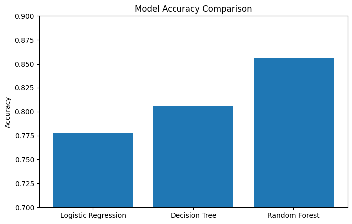
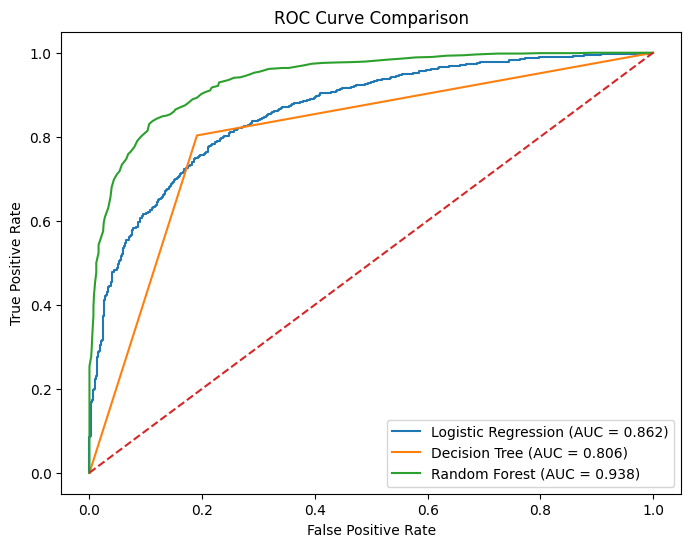
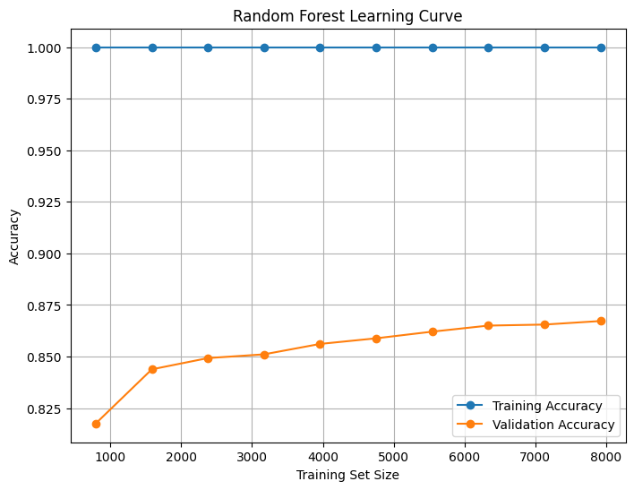
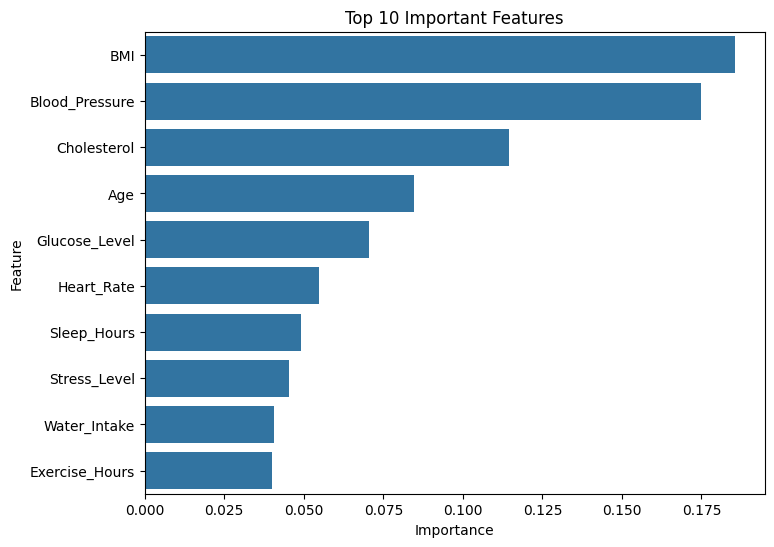

# Health Risk Classification for Insurance Premium Optimization

## Overview

Health insurance providers rely on accurate risk assessment to determine applicant eligibility and premium pricing. This project develops a machine learning classification system capable of predicting whether an insurance applicant is **Healthy** or **Unhealthy** using demographic, lifestyle, and medical attributes.

The project demonstrates a complete machine learning workflow including data auditing, exploratory data analysis, preprocessing, model development, model comparison, ROC-AUC evaluation, learning curve analysis, feature importance analysis, and business recommendations.

---

## Problem Statement

Anova Insurance seeks to optimize health insurance premium pricing based on the health condition of applicants.

The objective is to develop a predictive model that classifies applicants into:

* **Healthy (0)**
* **Unhealthy (1)**

This classification can support:

* Insurance eligibility assessment
* Risk-based premium pricing
* Early identification of high-risk applicants
* Data-driven underwriting decisions

---

## Machine Learning Workflow

```text
Raw Dataset
     │
     ▼
Data Audit
     │
     ▼
Exploratory Data Analysis
     │
     ▼
Data Preprocessing
     │
     ▼
Logistic Regression
     │
     ▼
Decision Tree
     │
     ▼
Random Forest
     │
     ▼
ROC-AUC Analysis
     │
     ▼
Learning Curve Analysis
     │
     ▼
Feature Importance Analysis
     │
     ▼
Final Model Selection
```

---

## Dataset Summary

| Attribute      | Value                 |
| -------------- | --------------------- |
| Records        | 10,000                |
| Features       | 23                    |
| Problem Type   | Binary Classification |
| Target Classes | Healthy / Unhealthy   |

### Numerical Features

* Age
* BMI
* Blood Pressure
* Cholesterol
* Glucose Level
* Heart Rate
* Sleep Hours
* Exercise Hours
* Water Intake
* Stress Level

### Lifestyle & Medical Features

* Smoking
* Alcohol
* Diet
* Mental Health
* Physical Activity
* Medical History
* Allergies

---

## Data Audit & Preprocessing

### Key Findings

* No duplicate records identified.
* Five columns contained missing values.
* 96 records contained invalid Age values equal to zero.
* Dataset classes were nearly perfectly balanced.

### Preprocessing Steps

* Removed invalid Age = 0 records.
* Median imputation:

  * Blood Pressure
  * Cholesterol
  * Glucose Level
* Mode imputation:

  * Medical History
  * Allergies
* Verified zero remaining missing values.

Final dataset size:

```text
9,904 records
```

---

## Exploratory Data Analysis

The following analyses were performed:

### Univariate Analysis

* Numerical feature distributions
* Boxplot-based outlier analysis
* Categorical feature distributions

### Bivariate Analysis

* Numerical features vs Target
* Categorical features vs Target
* Correlation analysis

### Key Findings

* BMI showed the strongest positive relationship with health risk.
* Blood Pressure, Cholesterol, Age, and Glucose Level were influential predictors.
* Most categorical variables exhibited relatively weak standalone predictive power.

---

## Models Evaluated

### 1. Logistic Regression

Baseline classification model.

**Results**

* Accuracy: **78.0%**
* ROC-AUC: **0.862**

---

### 2. Decision Tree

Tree-based classifier capable of learning non-linear relationships.

**Results**

* Accuracy: **80.6%**
* ROC-AUC: **0.806**

Training accuracy reached 100%, indicating overfitting.

---

### 3. Random Forest

Ensemble learning approach using multiple decision trees.

**Results**

* Accuracy: **85.6%**
* ROC-AUC: **0.938**

Random Forest achieved the best overall performance.

---

## Model Performance Comparison

| Model               |  Accuracy |   ROC-AUC |
| ------------------- | --------: | --------: |
| Logistic Regression |     0.780 |     0.862 |
| Decision Tree       |     0.806 |     0.806 |
| Random Forest       | **0.856** | **0.938** |

### Performance Visualization



---

## ROC-AUC Analysis

ROC curves were generated for all models to evaluate discrimination capability across classification thresholds.

### Results

| Model               |   ROC-AUC |
| ------------------- | --------: |
| Logistic Regression |     0.862 |
| Decision Tree       |     0.806 |
| Random Forest       | **0.938** |

### ROC Curve



---

## Learning Curve Analysis

Learning curve analysis was performed for the Random Forest model.

### Observations

* Training accuracy remained close to 100%.
* Validation accuracy improved steadily as additional data was introduced.
* The model demonstrated strong generalization capability.

### Learning Curve



---

## Feature Importance Analysis

Random Forest feature importance analysis identified the most influential predictors.

### Top Features

1. BMI
2. Blood Pressure
3. Cholesterol
4. Age
5. Glucose Level

### Feature Importance Plot



---

## Business Recommendations

Based on the findings:

* Implement risk-based premium pricing strategies.
* Prioritize BMI, Blood Pressure, Cholesterol, and Glucose Level during underwriting.
* Introduce wellness programs for high-risk applicants.
* Use machine learning-assisted screening to improve underwriting consistency and efficiency.

---

## Final Model Selection

### Selected Model: Random Forest Classifier

Reasons:

* Highest Accuracy (85.6%)
* Highest ROC-AUC (0.938)
* Balanced Precision and Recall
* Strong generalization performance
* Interpretable feature importance

---

## Technologies Used

* Python
* Pandas
* NumPy
* Matplotlib
* Seaborn
* Scikit-learn

---

## Repository Structure

```text
health-risk-classification-insurance/
│
├── Health_Risk_Classification.ipynb
├── Health_Risk_Classification_Report.pdf
├── dataset/
│   └── Healthcare_Data_Preprocessed_FIXED.csv
│
├── images/
│   ├── numerical_distributions.png
│   ├── categorical_distributions.png
│   ├── model_comparison.png
│   ├── roc_curve.png
│   ├── learning_curve.png
│   └── feature_importance.png
│
└── README.md
```

---

## Author

**Ruthuraraj R**

Assistant Professor | Mechanical Engineering
Applied AI, Machine Learning, Generative AI, AI Agents, and Engineering Intelligence Systems
